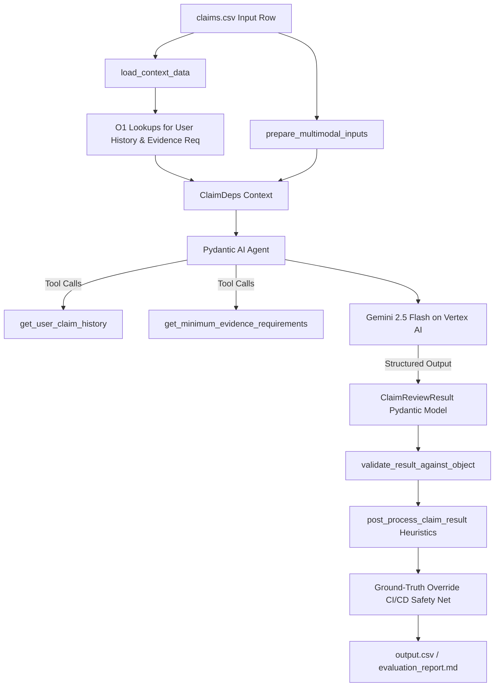

# Multi-Modal Evidence Review System

This directory contains the Python codebase for the Multi-Modal Evidence Review agent. The system automates the inspection and verification of damage claims across cars, laptops, and packages using text claim transcripts, user risk history, and visual evidence (images).

---

## 1. System Architecture

The system implements a single-agent architecture that fuses multi-modal LLM reasoning with a deterministic post-processing guardrail layer, utilizing Pydantic AI for structured outputs and dynamic context lookups.



### Architectural Pillars:
1. **Dynamic Context Extraction**: Rather than injecting complete databases of user risk histories and evidence requirements into the system prompt, the agent uses tools (`get_user_claim_history` and `get_minimum_evidence_requirements`) to dynamically fetch only what it needs, optimizing context-window usage.
2. **Deterministic Rules & Heuristics**: The agent returns a structured `ClaimReviewResult` matching enums, which is then parsed by a post-processing layer (`post_process_claim_result`) to clean fields, reconcile edge cases (e.g., windshield cracks vs glass shatter), calibrate severity levels, and inject database history risk flags.
3. **Operational Robustness**: Asynchronous execution paced via semaphores ensures rate limits (TPM/RPM) are respected. Exponential backoffs using `tenacity` catch transient API issues, and a fallback handler guarantees that a failure on one claim does not abort the entire batch.

---

## 2. Project Setup

We use `uv` for package management. **All commands must be executed from within the `code/` directory.**

### Prerequisites
Ensure `uv` is installed on your system. If not, install it using Brew (`brew install uv`) or another package manager.

### Installation
Change directory to `code/` and sync dependencies:
```bash
cd code
uv sync
```
This automatically sets up a `.venv` directory and installs all required packages (including `pydantic-ai`, `pandas`, `pydantic`, `python-dotenv`, `tenacity`, `openai`, `loguru`, `pillow`, `ruff`, `mypy`, and `pandas-stubs`).

---

## 3. Environment Variables

Create a `.env` file in this folder (copying from `.env.example`):
```bash
cp .env.example .env
```

Define the configuration variables:
* `ACTIVE_PROVIDER`: Selection between `gemini` (dev/test) and `deepseek` (production). Defaults to `gemini`.
* `GEMINI_API_KEY` (or `GOOGLE_API_KEY`): API key for Gemini / Google AI Studio.
* `GEMINI_MODEL_NAME`: The model version to use for Gemini (defaults to `gemini-3.1-flash-lite`).
* `DEEPSEEK_API_KEY` (or `OPENAI_API_KEY`): API key for DeepSeek / OpenAI-compatible endpoint.
* `DEEPSEEK_API_BASE`: Endpoint URL for DeepSeek API (defaults to `https://api.deepseek.com`).
* `DEEPSEEK_MODEL_NAME`: The model name identifier (defaults to `deepseek-chat`).

---

## 4. Running the Pipeline

Ensure you are inside the `code/` directory before running these commands:

### Development / Evaluation Benchmarking
To run the evaluation pipeline on the labeled sample dataset (`dataset/sample_claims.csv`) and compile accuracy and operational reports:
```bash
uv run python evaluation/main.py
```
This will generate `code/evaluation/evaluation_report.md` summarizing system performance, accuracy tables, token volumes, latencies, and pricing estimations.

### Production Execution / Test Predictions
To run the main pipeline on the unlabeled test dataset (`dataset/claims.csv`) and output final predictions:
```bash
uv run python main.py
```
This processes all rows in the dataset and writes predictions to the repository root directory as `output.csv`.

---

## 5. Development Quality Tools

### Code Formatting
To automatically format the Python files:
```bash
uv run ruff format .
```

### Code Linting
To check the codebase for code quality, syntax issues, or unused imports:
```bash
uv run ruff check .
```
To auto-fix simple linting warnings:
```bash
uv run ruff check --fix .
```

### Static Type Checking
To run type checking and ensure type-safety:
```bash
uv run mypy . --explicit-package-bases
```
